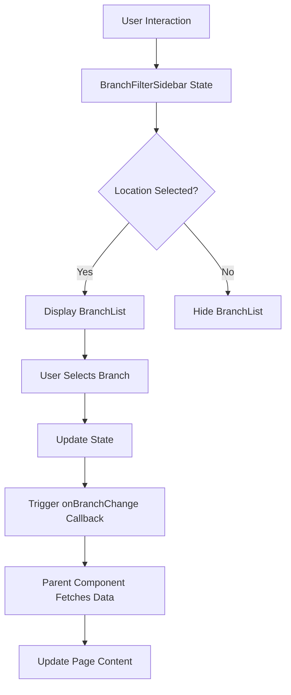

# Design Document: Branch Filter Sidebar

## Overview

The Branch Filter Sidebar is a client-side React component built with Next.js and TypeScript that provides location-based content filtering for the Meem Market landing page. The component implements a two-tier selection system: first selecting a country (Saudi Arabia or Kuwait), then selecting a specific branch within that country.

The design emphasizes modularity, accessibility, and seamless integration with the existing Meem Market design system. The component uses React hooks for state management, next-intl for localization, and Tailwind CSS for styling with custom theme variables.

### Key Design Principles

1. **Progressive Disclosure**: Show location options first, then reveal branch options only after location selection
2. **Single Responsibility**: Each sub-component handles one specific concern (location selection, branch list, state management)
3. **Responsive First**: Mobile-first design with progressive enhancement for larger screens
4. **Accessibility by Default**: WCAG 2.1 AA compliance with keyboard navigation and screen reader support
5. **Performance**: Minimal re-renders through proper memoization and state management

## Architecture

### Component Hierarchy

```
BranchFilterSidebar (Container)
├── LocationSelector (Location selection UI)
├── BranchList (Branch listing and selection)
└── LoadingIndicator (Loading state display)
```

### Data Flow



### State Management Strategy

The component uses React's `useState` hook for local state management with the following state structure:

```typescript
interface FilterState {
  selectedLocation: Location | null;
  selectedBranch: Branch | null;
  isLoading: boolean;
  error: string | null;
}
```

State updates follow a unidirectional flow:
1. User interaction triggers event handler
2. Event handler updates local state
3. State change triggers callback to parent component
4. Parent component handles data fetching and content updates

## Components and Interfaces

### 1. BranchFilterSidebar (Main Container)

**Purpose**: Main container component that orchestrates the sidebar functionality and manages overall state.

**Props Interface**:
```typescript
interface BranchFilterSidebarProps {
  locations: Location[];
  branches: Branch[];
  onBranchChange: (branch: Branch | null) => void;
  onLocationChange?: (location: Location | null) => void;
  defaultLocation?: string;
  defaultBranch?: string;
  className?: string;
}
```

**State**:
```typescript
const [selectedLocation, setSelectedLocation] = useState<Location | null>(null);
const [selectedBranch, setSelectedBranch] = useState<Branch | null>(null);
const [isOpen, setIsOpen] = useState<boolean>(true); // For mobile collapse
```

**Key Methods**:
- `handleLocationSelect(location: Location)`: Updates selected location and clears branch selection
- `handleBranchSelect(branch: Branch)`: Updates selected branch and triggers callback
- `toggleSidebar()`: Toggles sidebar visibility on mobile devices
- `getFilteredBranches()`: Returns branches for the currently selected location

**Rendering Logic**:
```typescript
// Desktop: Fixed sidebar
// Tablet: Collapsible sidebar with toggle
// Mobile: Bottom sheet modal
const sidebarClasses = cn(
  'bg-background-light border-r border-gray-200',
  'transition-transform duration-300 ease-in-out',
  {
    'fixed left-0 top-[80px] h-[calc(100vh-80px)] w-80': isDesktop,
    'fixed left-0 top-[80px] h-[calc(100vh-80px)] w-80 -translate-x-full': isTablet && !isOpen,
    'fixed bottom-0 left-0 right-0 rounded-t-3xl max-h-[70vh]': isMobile,
  }
);
```

### 2. LocationSelector Component

**Purpose**: Displays location options and handles location selection.

**Props Interface**:
```typescript
interface LocationSelectorProps {
  locations: Location[];
  selectedLocation: Location | null;
  onSelect: (location: Location) => void;
  locale: string;
}
```

**Rendering**:
```typescript
// Radio button group with custom styling
<div className="space-y-3">
  {locations.map((location) => (
    <button
      key={location.id}
      onClick={() => onSelect(location)}
      className={cn(
        'w-full p-4 rounded-lg border-2 transition-all duration-200',
        'flex items-center justify-between',
        'hover:border-gold hover:bg-gold/5',
        {
          'border-primary bg-primary/5': selectedLocation?.id === location.id,
          'border-gray-200': selectedLocation?.id !== location.id,
        }
      )}
      aria-pressed={selectedLocation?.id === location.id}
    >
      <span className="font-medium">{location.name[locale]}</span>
      {selectedLocation?.id === location.id && (
        <span className="material-icons-outlined text-primary">check_circle</span>
      )}
    </button>
  ))}
</div>
```

### 3. BranchList Component

**Purpose**: Displays branches for the selected location and handles branch selection.

**Props Interface**:
```typescript
interface BranchListProps {
  branches: Branch[];
  selectedBranch: Branch | null;
  onSelect: (branch: Branch) => void;
  locale: string;
  isLoading?: boolean;
}
```

**Rendering**:
```typescript
// Scrollable list with max height
<div className="mt-6">
  <h3 className="text-sm font-semibold text-secondary-text mb-3">
    {t('selectBranch')}
  </h3>
  <div className="space-y-2 max-h-[400px] overflow-y-auto custom-scrollbar">
    {branches.map((branch) => (
      <button
        key={branch.id}
        onClick={() => onSelect(branch)}
        className={cn(
          'w-full p-3 rounded-lg text-left transition-all duration-200',
          'hover:bg-primary/5',
          {
            'bg-primary text-white': selectedBranch?.id === branch.id,
            'bg-white': selectedBranch?.id !== branch.id,
          }
        )}
        aria-pressed={selectedBranch?.id === branch.id}
      >
        <div className="flex items-start gap-2">
          <span className="material-icons-outlined text-sm mt-0.5">
            {selectedBranch?.id === branch.id ? 'radio_button_checked' : 'radio_button_unchecked'}
          </span>
          <div>
            <div className="font-medium">{branch.name[locale]}</div>
            {branch.address && (
              <div className="text-xs opacity-75 mt-1">{branch.address[locale]}</div>
            )}
          </div>
        </div>
      </button>
    ))}
  </div>
</div>
```

### 4. LoadingIndicator Component

**Purpose**: Displays loading state during data fetching operations.

**Props Interface**:
```typescript
interface LoadingIndicatorProps {
  message?: string;
}
```

**Rendering**:
```typescript
<div className="flex items-center justify-center p-6">
  <div className="flex flex-col items-center gap-3">
    <div className="w-8 h-8 border-3 border-primary border-t-transparent rounded-full animate-spin" />
    {message && <p className="text-sm text-secondary-text">{message}</p>}
  </div>
</div>
```

### 5. Mobile Toggle Button

**Purpose**: Provides a button to open the sidebar on mobile and tablet devices.

**Rendering**:
```typescript
// Only visible on mobile/tablet when sidebar is closed
<button
  onClick={toggleSidebar}
  className={cn(
    'fixed z-40 bg-primary text-white rounded-full p-4 shadow-lg',
    'transition-all duration-300 hover:bg-primary-dark',
    {
      'bottom-6 right-6': isMobile,
      'left-6 top-24': isTablet && !isOpen,
      'hidden': isDesktop || isOpen,
    }
  )}
  aria-label={t('openFilters')}
>
  <span className="material-icons-outlined">tune</span>
</button>
```

## Data Models

### Location Model

```typescript
interface Location {
  id: string;
  code: 'SA' | 'KW'; // ISO country codes
  name: {
    en: string;
    ar: string;
  };
  flag?: string; // Optional emoji or icon
}
```

**Example Data**:
```typescript
const locations: Location[] = [
  {
    id: 'saudi-arabia',
    code: 'SA',
    name: {
      en: 'Saudi Arabia',
      ar: 'المملكة العربية السعودية'
    },
    flag: '🇸🇦'
  },
  {
    id: 'kuwait',
    code: 'KW',
    name: {
      en: 'Kuwait',
      ar: 'الكويت'
    },
    flag: '🇰🇼'
  }
];
```

### Branch Model

```typescript
interface Branch {
  id: string;
  locationId: string; // References Location.id
  name: {
    en: string;
    ar: string;
  };
  address?: {
    en: string;
    ar: string;
  };
  city: {
    en: string;
    ar: string;
  };
  coordinates?: {
    lat: number;
    lng: number;
  };
  phone?: string;
  hours?: {
    open: string;
    close: string;
  };
}
```

**Example Data**:
```typescript
const branches: Branch[] = [
  {
    id: 'riyadh-olaya',
    locationId: 'saudi-arabia',
    name: {
      en: 'Riyadh - Olaya',
      ar: 'الرياض - العليا'
    },
    address: {
      en: 'Olaya Street, Riyadh',
      ar: 'شارع العليا، الرياض'
    },
    city: {
      en: 'Riyadh',
      ar: 'الرياض'
    },
    coordinates: {
      lat: 24.7136,
      lng: 46.6753
    },
    phone: '+966 11 234 5678',
    hours: {
      open: '08:00',
      close: '23:00'
    }
  },
  {
    id: 'jeddah-tahlia',
    locationId: 'saudi-arabia',
    name: {
      en: 'Jeddah - Tahlia',
      ar: 'جدة - التحلية'
    },
    address: {
      en: 'Tahlia Street, Jeddah',
      ar: 'شارع التحلية، جدة'
    },
    city: {
      en: 'Jeddah',
      ar: 'جدة'
    },
    phone: '+966 12 345 6789',
    hours: {
      open: '08:00',
      close: '23:00'
    }
  },
  {
    id: 'kuwait-city-salmiya',
    locationId: 'kuwait',
    name: {
      en: 'Kuwait City - Salmiya',
      ar: 'مدينة الكويت - السالمية'
    },
    address: {
      en: 'Salem Al Mubarak Street, Salmiya',
      ar: 'شارع سالم المبارك، السالمية'
    },
    city: {
      en: 'Kuwait City',
      ar: 'مدينة الكويت'
    },
    phone: '+965 2222 3333',
    hours: {
      open: '08:00',
      close: '23:00'
    }
  }
];
```

### Translation Keys

**Required translation keys in messages/en.json and messages/ar.json**:

```json
{
  "branchFilter": {
    "title": "Select Your Branch",
    "selectLocation": "Select Location",
    "selectBranch": "Select Branch",
    "noLocationSelected": "Please select a location first",
    "noBranchesAvailable": "No branches available",
    "loading": "Loading branches...",
    "error": "Failed to load branches",
    "openFilters": "Open Filters",
    "closeFilters": "Close Filters",
    "applyFilters": "Apply Filters",
    "clearFilters": "Clear Filters"
  }
}
```

## Responsive Behavior

### Desktop (≥1024px)
- Fixed sidebar on the left side
- Width: 320px (w-80)
- Top position: Below navbar (top-[80px])
- Height: Full viewport minus navbar (h-[calc(100vh-80px)])
- Always visible
- Sticky positioning during scroll

### Tablet (768px - 1023px)
- Collapsible sidebar
- Same dimensions as desktop
- Toggle button appears when collapsed
- Slides in/out from left with transform animation
- Semi-transparent backdrop when open

### Mobile (<768px)
- Bottom sheet modal
- Full width
- Max height: 70% of viewport (max-h-[70vh])
- Rounded top corners (rounded-t-3xl)
- Slides up from bottom
- Dark backdrop overlay when open
- Swipe-down gesture to close (optional enhancement)

### Breakpoint Implementation

```typescript
// Using Tailwind's responsive utilities and custom hook
const useResponsive = () => {
  const [breakpoint, setBreakpoint] = useState<'mobile' | 'tablet' | 'desktop'>('desktop');

  useEffect(() => {
    const handleResize = () => {
      const width = window.innerWidth;
      if (width < 768) setBreakpoint('mobile');
      else if (width < 1024) setBreakpoint('tablet');
      else setBreakpoint('desktop');
    };

    handleResize();
    window.addEventListener('resize', handleResize);
    return () => window.removeEventListener('resize', handleResize);
  }, []);

  return breakpoint;
};
```

## RTL Support

### Layout Direction

```typescript
// Automatic RTL support based on locale
const direction = locale === 'ar' ? 'rtl' : 'ltr';

<div dir={direction} className="branch-filter-sidebar">
  {/* Content */}
</div>
```

### Tailwind RTL Classes

```typescript
// Use logical properties for RTL support
className={cn(
  'ps-4 pe-4', // padding-inline-start, padding-inline-end
  'ms-2 me-2', // margin-inline-start, margin-inline-end
  'border-e border-gray-200', // border-inline-end
)}
```

### Icon Mirroring

```typescript
// Mirror directional icons in RTL
<span className={cn(
  'material-icons-outlined',
  { 'scale-x-[-1]': locale === 'ar' } // Flip horizontally for RTL
)}>
  arrow_forward
</span>
```

## Styling and Theming

### Color Palette

```css
/* Using CSS custom properties from globals.css */
.branch-filter-sidebar {
  --sidebar-bg: var(--background-light); /* #f5f8fc */
  --sidebar-border: var(--gray-200); /* #e5e7eb */
  --active-bg: var(--primary); /* #124e91 */
  --active-text: var(--white); /* #ffffff */
  --hover-bg: var(--gold-light); /* #f3e5ab */
  --hover-border: var(--gold); /* #d4af37 */
  --text-primary: var(--gray-800); /* #1f2937 */
  --text-secondary: var(--secondary-text); /* #6b7c93 */
}
```

### Typography

```css
/* Font families based on locale */
.branch-filter-sidebar {
  font-family: var(--font-display); /* Inter for English */
}

.branch-filter-sidebar[dir="rtl"] {
  font-family: var(--font-arabic); /* Almarai for Arabic */
}
```

### Custom Scrollbar

```css
/* Custom scrollbar for branch list */
.custom-scrollbar::-webkit-scrollbar {
  width: 6px;
}

.custom-scrollbar::-webkit-scrollbar-track {
  background: transparent;
}

.custom-scrollbar::-webkit-scrollbar-thumb {
  background: var(--gray-200);
  border-radius: 3px;
}

.custom-scrollbar::-webkit-scrollbar-thumb:hover {
  background: var(--secondary-text);
}
```

### Animation Classes

```css
/* Smooth transitions */
.sidebar-transition {
  transition: transform 300ms cubic-bezier(0.4, 0, 0.2, 1);
}

.selection-transition {
  transition: all 200ms cubic-bezier(0.4, 0, 0.2, 1);
}

/* Backdrop fade */
.backdrop-fade-enter {
  opacity: 0;
}

.backdrop-fade-enter-active {
  opacity: 1;
  transition: opacity 300ms ease-in-out;
}

.backdrop-fade-exit {
  opacity: 1;
}

.backdrop-fade-exit-active {
  opacity: 0;
  transition: opacity 300ms ease-in-out;
}
```

## Integration with Page

### Placement in Page Structure

```typescript
// app/[locale]/page.tsx
export default function Home() {
  const [selectedBranch, setSelectedBranch] = useState<Branch | null>(null);
  const [offers, setOffers] = useState<Offer[]>([]);
  const [isLoading, setIsLoading] = useState(false);

  const handleBranchChange = async (branch: Branch | null) => {
    setSelectedBranch(branch);
    
    if (branch) {
      setIsLoading(true);
      try {
        const data = await fetchBranchOffers(branch.id);
        setOffers(data);
      } catch (error) {
        console.error('Failed to fetch offers:', error);
      } finally {
        setIsLoading(false);
      }
    } else {
      setOffers([]);
    }
  };

  return (
    <>
      <Navbar />
      <Hero />
      
      {/* Branch Filter Sidebar */}
      <div className="relative">
        <BranchFilterSidebar
          locations={locations}
          branches={branches}
          onBranchChange={handleBranchChange}
          className="mt-8"
        />
        
        {/* Main Content with offset for sidebar on desktop */}
        <main className="lg:ml-80 max-w-7xl mx-auto px-4 sm:px-6 lg:px-8 pb-20">
          {isLoading ? (
            <LoadingIndicator message="Loading offers..." />
          ) : (
            <>
              {/* Category cards and other content */}
              <CategoryGrid offers={offers} />
            </>
          )}
        </main>
      </div>
      
      <AppBanner />
      <Footer />
    </>
  );
}
```

### Content Offset Strategy

```typescript
// Desktop: Add left margin to main content to account for fixed sidebar
// Mobile/Tablet: No offset needed as sidebar is overlay

const mainContentClasses = cn(
  'max-w-7xl mx-auto px-4 sm:px-6 lg:px-8 pb-20',
  'transition-all duration-300',
  {
    'lg:ml-80': isDesktop, // 320px offset for sidebar
    'ml-0': !isDesktop,
  }
);
```


## Correctness Properties

A property is a characteristic or behavior that should hold true across all valid executions of a system—essentially, a formal statement about what the system should do. Properties serve as the bridge between human-readable specifications and machine-verifiable correctness guarantees.

### Property 1: Location Selection Updates State and Displays Branches

*For any* location in the locations list, when a user selects that location, the sidebar should mark it as selected and display all branches associated with that location's ID.

**Validates: Requirements 1.2, 2.1**

### Property 2: Selection State Visual Indicators

*For any* selected location or branch, the sidebar should apply visual styling (CSS classes or ARIA attributes) to indicate the active selection state.

**Validates: Requirements 1.3, 3.2**

### Property 3: Location Switch Clears Branch Selection

*For any* two different locations, when a user has selected a branch from the first location and then switches to the second location, the selected branch should be cleared (set to null).

**Validates: Requirements 1.4, 4.5**

### Property 4: Localization Displays Correct Language

*For any* locale (English or Arabic), all text content in the sidebar should be displayed in the language corresponding to that locale.

**Validates: Requirements 1.5, 2.3, 7.1, 7.2**

### Property 5: Branch Filtering by Location

*For any* selected location, the displayed branch list should contain only branches where the branch's locationId matches the selected location's id, and should contain all such branches.

**Validates: Requirements 2.1**

### Property 6: Single Branch Selection

*For any* sequence of branch selections, at most one branch should be marked as selected at any given time, and selecting a new branch should remove the selection state from any previously selected branch.

**Validates: Requirements 3.3, 3.4**

### Property 7: Branch Selection Updates State

*For any* branch in the branch list, when a user selects that branch, the sidebar should update the Filter_State with that branch as the Selected_Branch.

**Validates: Requirements 3.1, 4.2**

### Property 8: State Persistence Across Re-renders

*For any* selected branch, if the component re-renders without unmounting, the selected branch should remain selected.

**Validates: Requirements 3.5**

### Property 9: Location Selection Updates State

*For any* location in the locations list, when a user selects that location, the sidebar should update the Filter_State with that location as the Selected_Location.

**Validates: Requirements 4.1**

### Property 10: State Changes Trigger Callbacks

*For any* state change (location or branch selection), the sidebar should invoke the appropriate callback function (onLocationChange or onBranchChange) with the new state value.

**Validates: Requirements 4.3, 5.1**

### Property 11: RTL Layout Based on Locale

*For any* locale, the sidebar should apply RTL layout direction when the locale is Arabic and LTR layout direction when the locale is English.

**Validates: Requirements 7.3, 7.4**

### Property 12: Keyboard Navigation Through Interactive Elements

*For any* interactive element in the sidebar, a user should be able to navigate to it using the Tab key and activate it using Enter or Space keys.

**Validates: Requirements 9.1, 9.2**

### Property 13: ARIA Labels on Interactive Elements

*For any* interactive element (location button, branch button, toggle button), the element should have an appropriate ARIA label or aria-pressed attribute.

**Validates: Requirements 9.3**

### Property 14: Text Contrast Ratio Compliance

*For any* text element in the sidebar, the contrast ratio between the text color and its background color should be at least 4.5:1.

**Validates: Requirements 9.5**

### Property 15: Focus Indicators on Focusable Elements

*For any* focusable element, when that element receives focus, a visible focus indicator should be displayed.

**Validates: Requirements 9.6**

### Property 16: Selection Transitions

*For any* location or branch selection action, the visual state change should include a CSS transition effect.

**Validates: Requirements 10.2**

### Property 17: Hover Effects on Interactive Elements

*For any* interactive element, when a user hovers over it, hover effects should be applied with a transition.

**Validates: Requirements 10.4**

## Error Handling

### Error Scenarios

1. **Empty Location List**
   - Behavior: Display a message indicating no locations are available
   - UI: Show placeholder text "No locations available"
   - User Action: None available

2. **Empty Branch List for Selected Location**
   - Behavior: Display a message indicating no branches are available for the selected location
   - UI: Show placeholder text "No branches available in this location"
   - User Action: User can select a different location

3. **Invalid Location or Branch ID**
   - Behavior: Log error to console and ignore the invalid selection
   - UI: No visual change
   - User Action: Component continues to function normally

4. **Data Fetch Failure (Parent Component)**
   - Behavior: Parent component handles the error
   - UI: Sidebar displays error state if error prop is provided
   - User Action: User can retry by selecting a different branch or the same branch again

5. **Missing Translation Keys**
   - Behavior: next-intl will display the translation key as fallback
   - UI: Show the key (e.g., "branchFilter.title")
   - User Action: None available (development issue)

### Error State UI

```typescript
interface ErrorDisplayProps {
  error: string | null;
  onRetry?: () => void;
}

const ErrorDisplay: React.FC<ErrorDisplayProps> = ({ error, onRetry }) => {
  if (!error) return null;

  return (
    <div className="p-4 bg-red-50 border border-red-200 rounded-lg">
      <div className="flex items-start gap-3">
        <span className="material-icons-outlined text-red-500">error_outline</span>
        <div className="flex-1">
          <p className="text-sm text-red-800 font-medium mb-2">{error}</p>
          {onRetry && (
            <button
              onClick={onRetry}
              className="text-xs text-red-600 hover:text-red-800 font-medium underline"
            >
              Try Again
            </button>
          )}
        </div>
      </div>
    </div>
  );
};
```

### Validation

```typescript
// Validate props on component mount
useEffect(() => {
  if (!locations || locations.length === 0) {
    console.warn('BranchFilterSidebar: No locations provided');
  }

  if (!branches || branches.length === 0) {
    console.warn('BranchFilterSidebar: No branches provided');
  }

  // Validate that all branches reference valid locations
  const locationIds = new Set(locations.map(loc => loc.id));
  const invalidBranches = branches.filter(branch => !locationIds.has(branch.locationId));
  
  if (invalidBranches.length > 0) {
    console.error('BranchFilterSidebar: Found branches with invalid locationId:', invalidBranches);
  }
}, [locations, branches]);
```

## Testing Strategy

### Dual Testing Approach

The Branch Filter Sidebar will be tested using both unit tests and property-based tests to ensure comprehensive coverage:

- **Unit tests**: Verify specific examples, edge cases, error conditions, and UI rendering
- **Property tests**: Verify universal properties across all inputs using randomized data

Both testing approaches are complementary and necessary. Unit tests catch concrete bugs in specific scenarios, while property tests verify general correctness across a wide range of inputs.

### Property-Based Testing

We will use **fast-check** (for TypeScript/JavaScript) as our property-based testing library. Each property test will:

- Run a minimum of 100 iterations with randomized inputs
- Reference its corresponding design document property
- Use the tag format: **Feature: branch-filter-sidebar, Property {number}: {property_text}**

**Example Property Test Structure**:

```typescript
import fc from 'fast-check';
import { render, screen, fireEvent } from '@testing-library/react';
import { BranchFilterSidebar } from './BranchFilterSidebar';

// Feature: branch-filter-sidebar, Property 1: Location Selection Updates State and Displays Branches
describe('Property 1: Location Selection Updates State and Displays Branches', () => {
  it('should mark location as selected and display its branches for any location', () => {
    fc.assert(
      fc.property(
        fc.array(locationArbitrary(), { minLength: 1, maxLength: 5 }),
        fc.array(branchArbitrary(), { minLength: 1, maxLength: 20 }),
        (locations, branches) => {
          const onBranchChange = jest.fn();
          const { rerender } = render(
            <BranchFilterSidebar
              locations={locations}
              branches={branches}
              onBranchChange={onBranchChange}
            />
          );

          // Select a random location
          const randomLocation = locations[Math.floor(Math.random() * locations.length)];
          const locationButton = screen.getByText(randomLocation.name.en);
          fireEvent.click(locationButton);

          // Verify location is marked as selected
          expect(locationButton).toHaveAttribute('aria-pressed', 'true');

          // Verify branches for this location are displayed
          const expectedBranches = branches.filter(b => b.locationId === randomLocation.id);
          expectedBranches.forEach(branch => {
            expect(screen.getByText(branch.name.en)).toBeInTheDocument();
          });
        }
      ),
      { numRuns: 100 }
    );
  });
});
```

### Unit Testing Focus Areas

Unit tests should focus on:

1. **Specific Examples**
   - Initial render with no selection (Requirement 2.2)
   - Desktop, tablet, and mobile responsive layouts (Requirements 6.1, 6.2, 6.3)
   - Loading indicator display (Requirement 5.2)
   - Error message display (Requirement 5.4)

2. **Edge Cases**
   - More than 5 branches triggering scroll (Requirement 2.5)
   - Empty location list
   - Empty branch list for a location
   - Rapid successive selections

3. **Visual Design Verification**
   - Brand colors applied correctly (Requirements 8.1-8.3)
   - Font families for English and Arabic (Requirement 8.4)
   - Transition timings (Requirements 8.5, 10.1, 10.3)
   - Border radius and shadows (Requirements 8.6, 8.7)

4. **Integration Points**
   - Positioning after Hero component (Requirements 12.1-12.3, 12.5)
   - Callback invocation with correct arguments
   - Locale switching behavior

### Test Data Generators (Arbitraries)

```typescript
// Arbitrary for generating random locations
const locationArbitrary = () =>
  fc.record({
    id: fc.uuid(),
    code: fc.constantFrom('SA', 'KW'),
    name: fc.record({
      en: fc.string({ minLength: 3, maxLength: 20 }),
      ar: fc.string({ minLength: 3, maxLength: 20 }),
    }),
  });

// Arbitrary for generating random branches
const branchArbitrary = () =>
  fc.record({
    id: fc.uuid(),
    locationId: fc.uuid(),
    name: fc.record({
      en: fc.string({ minLength: 5, maxLength: 30 }),
      ar: fc.string({ minLength: 5, maxLength: 30 }),
    }),
    address: fc.option(
      fc.record({
        en: fc.string({ minLength: 10, maxLength: 50 }),
        ar: fc.string({ minLength: 10, maxLength: 50 }),
      })
    ),
    city: fc.record({
      en: fc.string({ minLength: 3, maxLength: 20 }),
      ar: fc.string({ minLength: 3, maxLength: 20 }),
    }),
  });
```

### Testing Tools

- **Testing Library**: @testing-library/react for component testing
- **Property Testing**: fast-check for property-based tests
- **Test Runner**: Jest or Vitest
- **Accessibility Testing**: jest-axe for automated accessibility checks
- **Visual Regression**: Chromatic or Percy (optional)

### Coverage Goals

- **Line Coverage**: Minimum 80%
- **Branch Coverage**: Minimum 75%
- **Property Tests**: All 17 correctness properties implemented
- **Unit Tests**: All edge cases and examples covered
- **Accessibility**: All WCAG 2.1 AA criteria verified

### Continuous Integration

All tests should run on:
- Pull request creation
- Commits to main branch
- Pre-deployment checks

Property tests should be configured to run with a fixed seed in CI to ensure reproducibility of failures.
