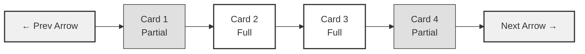

# Design Document

## Overview

This design replaces the current bento grid category layout with a modern, high-end carousel that showcases category images prominently. The design follows contemporary e-commerce patterns with clean image-only cards, smooth animations, and elegant navigation controls. The carousel will be built using the existing Swiper.js library and Next.js Image optimization, ensuring performance and accessibility while supporting both RTL and LTR layouts.

## Architecture

### Component Structure

```
HomePage (app/[locale]/page.tsx)
├── Hero
├── CategoryCarousel (NEW - replaces bento grid)
│   ├── Swiper Container
│   │   ├── SwiperSlide (x17 categories)
│   │   │   └── CategoryImageCard (NEW)
│   │   │       └── Next.js Image
│   │   ├── Navigation Arrows
│   │   └── Pagination Indicator
├── AboutUs
├── CompetitiveValue
└── ... (other sections)
```

### File Structure

```
app/
├── components/
│   └── Home/
│       ├── CategoryCarousel.tsx (NEW)
│       └── CategoryImageCard.tsx (NEW)
├── [locale]/
│   └── page.tsx (MODIFIED - replace bento grid)
└── data/
    └── categories.ts (EXISTING - no changes)
```

## Components and Interfaces

### CategoryCarousel Component

**Purpose:** Main carousel container that manages the Swiper instance and displays all categories.

**Props Interface:**
```typescript
interface CategoryCarouselProps {
  categories: Category[];
  locale: string;
}
```

**Key Features:**
- Swiper configuration with responsive breakpoints
- RTL/LTR direction handling
- Custom navigation arrows with hover reveal
- Pagination dots or progress bar
- Autoplay with pause on hover
- Keyboard navigation support
- ARIA labels for accessibility

**Swiper Configuration:**
```typescript
{
  modules: [Autoplay, Pagination, Navigation, A11y],
  spaceBetween: 24, // Modern spacing between cards
  slidesPerView: 'auto', // Dynamic based on breakpoints
  breakpoints: {
    320: { slidesPerView: 1.2, spaceBetween: 16 },
    768: { slidesPerView: 2.5, spaceBetween: 20 },
    1024: { slidesPerView: 3.5, spaceBetween: 24 }
  },
  loop: true,
  speed: 600,
  autoplay: {
    delay: 3500,
    disableOnInteraction: false,
    pauseOnMouseEnter: true
  },
  pagination: {
    clickable: true,
    dynamicBullets: true
  },
  navigation: true,
  keyboard: { enabled: true },
  a11y: {
    enabled: true,
    prevSlideMessage: 'Previous category',
    nextSlideMessage: 'Next category'
  }
}
```

### CategoryImageCard Component

**Purpose:** Individual card that displays a single category image with hover effects and click handling.

**Props Interface:**
```typescript
interface CategoryImageCardProps {
  category: Category;
  locale: string;
}
```

**Key Features:**
- Full-bleed image display (no text overlays)
- Next.js Image component for optimization
- Hover effect (subtle scale + shadow)
- Click handler for navigation
- Loading skeleton/placeholder
- Rounded corners matching design system
- Accessible link wrapper

**Styling:**
```typescript
{
  aspectRatio: '4/3', // Consistent card shape
  borderRadius: '24px', // Matches existing design system
  overflow: 'hidden',
  transition: 'transform 0.3s ease, box-shadow 0.3s ease',
  hover: {
    transform: 'scale(1.03)',
    boxShadow: '0 20px 40px rgba(0,0,0,0.15)'
  }
}
```

## Data Models

### Category Interface (Existing)

```typescript
interface Category {
  id: string;
  title: string;
  arabicTitle: string;
  description?: string;
  imagePath: string;
  badge?: string;
  discount?: string;
  icon?: string;
  isFeatured?: boolean;
  variant?: 'large' | 'tall' | 'wide' | 'small' | 'recipe';
}
```

**Usage in Carousel:**
- `id`: Unique key for React rendering
- `title`: Used for alt text and accessibility (English)
- `arabicTitle`: Used for alt text in Arabic locale
- `imagePath`: Source for Next.js Image component
- Other fields (badge, discount, icon, variant): NOT used in new design

### Navigation State

```typescript
interface CarouselState {
  activeIndex: number;
  isBeginning: boolean;
  isEnd: boolean;
  isHovered: boolean;
}
```

## Correctness Properties

*A property is a characteristic or behavior that should hold true across all valid executions of a system—essentially, a formal statement about what the system should do. Properties serve as the bridge between human-readable specifications and machine-verifiable correctness guarantees.*

### Property 1: All Categories Rendered

*For any* valid Category_Data array, the Category_Carousel should render exactly one CategoryImageCard for each category in the array.

**Validates: Requirements 1.2**

### Property 2: Image-Only Display

*For any* CategoryImageCard rendered, the card should contain only an image element and no text overlay elements (title, description, badge, discount, or button elements).

**Validates: Requirements 2.1, 2.2**

### Property 3: Image Path Consistency

*For any* CategoryImageCard rendered, the image src attribute should match the imagePath from the corresponding Category object.

**Validates: Requirements 2.4**

### Property 4: RTL/LTR Direction Mapping

*For any* locale value, when locale is 'ar', the Swiper dir attribute should be 'rtl', and when locale is 'en', the dir attribute should be 'ltr'.

**Validates: Requirements 4.1, 4.2**

### Property 5: Responsive Breakpoint Behavior

*For any* viewport width, the number of visible slides should match the configured breakpoint: width < 768px shows 1.2 slides, 768px ≤ width < 1024px shows 2.5 slides, width ≥ 1024px shows 3.5 slides.

**Validates: Requirements 5.1, 5.2, 5.3**

### Property 6: Touch Swipe Navigation

*For any* touch swipe gesture on mobile viewport (< 768px), swiping left should advance to the next slide and swiping right should go to the previous slide.

**Validates: Requirements 5.6**

### Property 7: Keyboard Navigation

*For any* keyboard arrow key press event when the carousel has focus, pressing right/down arrow should advance to the next slide and pressing left/up arrow should go to the previous slide.

**Validates: Requirements 6.1**

### Property 8: Focus Indicator Visibility

*For any* CategoryImageCard, when the card receives focus, a visible focus indicator (outline or ring) should be applied, and when focus is lost, the indicator should be removed.

**Validates: Requirements 6.4**

### Property 9: Click Navigation

*For any* CategoryImageCard click event, the navigation should be triggered to a URL containing the category ID.

**Validates: Requirements 8.1**

### Property 10: Hover State Consistency

*For any* CategoryImageCard, when the mouse enters the card boundary, hover styles should be applied, and when the mouse leaves, the hover styles should be removed.

**Validates: Requirements 3.3**

### Property 11: Image Loading State

*For any* CategoryImageCard during image load, a loading placeholder should be visible until the image onLoad event fires, at which point the placeholder should be hidden.

**Validates: Requirements 7.3**

## Error Handling

### Image Loading Failures

**Scenario:** Category image fails to load (404, network error, corrupt file)

**Handling:**
- Display fallback placeholder with category icon or generic image
- Log error to console for debugging
- Maintain card layout to prevent carousel breaking
- Show subtle error indicator (optional)

**Implementation:**
```typescript
<Image
  src={category.imagePath}
  alt={locale === 'ar' ? category.arabicTitle : category.title}
  fill
  sizes="(max-width: 768px) 85vw, (max-width: 1024px) 40vw, 28vw"
  className="object-cover"
  onError={(e) => {
    e.currentTarget.src = '/images/category-placeholder.webp';
    console.error(`Failed to load image: ${category.imagePath}`);
  }}
/>
```

### Invalid Category Data

**Scenario:** Category object missing required fields (id, imagePath, title)

**Handling:**
- Filter out invalid categories before rendering
- Log warning for missing data
- Continue rendering valid categories
- Ensure carousel doesn't break with empty array

**Implementation:**
```typescript
const validCategories = categories.filter(cat => 
  cat?.id && 
  cat?.imagePath && 
  cat?.title && 
  cat?.arabicTitle
);

if (validCategories.length === 0) {
  console.warn('No valid categories to display');
  return null;
}
```

### Swiper Initialization Failure

**Scenario:** Swiper library fails to initialize (rare edge case)

**Handling:**
- Fallback to static grid layout
- Log error for monitoring
- Ensure content remains accessible

### Locale Validation

**Scenario:** Invalid locale value passed to component

**Handling:**
- Default to 'en' locale
- Validate against supported locales ['en', 'ar']
- Log warning for invalid locale

**Implementation:**
```typescript
const validLocales = ['en', 'ar'];
const validatedLocale = validLocales.includes(locale) ? locale : 'en';
if (!validLocales.includes(locale)) {
  console.warn(`Invalid locale: ${locale}, defaulting to 'en'`);
}
```

## Testing Strategy

### Unit Testing

**Framework:** Jest + React Testing Library

**Test Cases:**
1. **Component Rendering**
   - CategoryCarousel renders with valid categories
   - CategoryImageCard renders with valid category data
   - Correct number of slides rendered
   - Fallback behavior with empty categories array

2. **Locale Handling**
   - RTL direction applied for Arabic locale
   - LTR direction applied for English locale
   - Navigation arrows reversed in RTL
   - Alt text uses correct language

3. **Error Handling**
   - Invalid category data filtered out
   - Image load errors show placeholder
   - Invalid locale defaults to 'en'

4. **Accessibility**
   - ARIA labels present on navigation controls
   - Keyboard event handlers attached
   - Focus indicators visible
   - Alt text present on all images

### Property-Based Testing

**Framework:** fast-check (for TypeScript/JavaScript)

**Configuration:**
- Minimum 100 iterations per property test
- Each test tagged with feature name and property number

**Property Tests:**

1. **Property 1: All Categories Rendered**
   - Generate random valid category arrays (1-50 categories)
   - Render CategoryCarousel
   - Assert: number of rendered CategoryImageCard components equals input array length
   - **Tag:** Feature: category-grid-carousel-optimization, Property 1: All categories rendered

2. **Property 2: Image-Only Display**
   - Generate random category
   - Render CategoryImageCard
   - Assert: no text elements (h1-h6, p, span with text content) present in card
   - Assert: no button or badge elements present
   - **Tag:** Feature: category-grid-carousel-optimization, Property 2: Image-only display

3. **Property 3: Image Path Consistency**
   - Generate random category with random imagePath
   - Render CategoryImageCard
   - Assert: Image src attribute matches category.imagePath
   - **Tag:** Feature: category-grid-carousel-optimization, Property 3: Image path consistency

4. **Property 4: RTL/LTR Direction Mapping**
   - Generate random locale ('en' or 'ar')
   - Render CategoryCarousel
   - Assert: Swiper dir attribute is 'rtl' when locale is 'ar', 'ltr' when locale is 'en'
   - **Tag:** Feature: category-grid-carousel-optimization, Property 4: RTL/LTR direction mapping

5. **Property 5: Responsive Breakpoint Behavior**
   - Generate random viewport widths (320px - 1920px)
   - Mock window.innerWidth
   - Render CategoryCarousel
   - Assert: slidesPerView matches expected breakpoint configuration
   - **Tag:** Feature: category-grid-carousel-optimization, Property 5: Responsive breakpoint behavior

6. **Property 6: Touch Swipe Navigation**
   - Generate random initial slide index
   - Mock mobile viewport (< 768px)
   - Render CategoryCarousel at that index
   - Simulate touchStart and touchEnd events (swipe left)
   - Assert: active index increments by 1
   - **Tag:** Feature: category-grid-carousel-optimization, Property 6: Touch swipe navigation

7. **Property 7: Keyboard Navigation**
   - Generate random initial slide index
   - Render CategoryCarousel at that index
   - Simulate ArrowRight keypress
   - Assert: active index increments by 1 (or wraps to 0 if at end)
   - **Tag:** Feature: category-grid-carousel-optimization, Property 7: Keyboard navigation

8. **Property 8: Focus Indicator Visibility**
   - Generate random category
   - Render CategoryImageCard
   - Simulate focus event
   - Assert: focus indicator class or style applied
   - Simulate blur event
   - Assert: focus indicator removed
   - **Tag:** Feature: category-grid-carousel-optimization, Property 8: Focus indicator visibility

9. **Property 9: Click Navigation**
   - Generate random category with random ID
   - Render CategoryImageCard
   - Simulate click event
   - Assert: navigation called with URL containing category.id
   - **Tag:** Feature: category-grid-carousel-optimization, Property 9: Click navigation

10. **Property 10: Hover State Consistency**
    - Generate random category
    - Render CategoryImageCard
    - Simulate mouseEnter event
    - Assert: hover class applied
    - Simulate mouseLeave event
    - Assert: hover class removed
    - **Tag:** Feature: category-grid-carousel-optimization, Property 10: Hover state consistency

11. **Property 11: Image Loading State**
    - Generate random category
    - Render CategoryImageCard with delayed image load
    - Assert: loading placeholder visible before onLoad fires
    - Trigger onLoad event
    - Assert: loading placeholder removed, image visible
    - **Tag:** Feature: category-grid-carousel-optimization, Property 11: Image loading state

### Integration Testing

**Test Scenarios:**
1. Full carousel interaction flow (render → navigate → click card)
2. Locale switching (English → Arabic → English)
3. Responsive behavior (desktop → mobile → tablet)
4. Autoplay with pause on hover
5. Navigation with keyboard and mouse

### Visual Regression Testing

**Tool:** Playwright or Chromatic

**Test Cases:**
1. Carousel appearance on desktop (1920x1080)
2. Carousel appearance on tablet (768x1024)
3. Carousel appearance on mobile (375x667)
4. Hover state visual changes
5. RTL vs LTR layout comparison
6. Loading state appearance

## Implementation Notes

### Styling Approach

Use Tailwind CSS classes matching the existing design system:
- Border radius: `rounded-[24px]` (consistent with current cards)
- Shadows: `shadow-lg`, `hover:shadow-2xl`
- Transitions: `transition-all duration-300 ease-out`
- Spacing: `gap-6` (24px between cards on desktop)

### Performance Considerations

1. **Image Optimization:**
   - Use Next.js Image component with `fill` layout
   - Specify appropriate `sizes` attribute for responsive images
   - Enable lazy loading for off-screen images
   - Use WebP format (already in use)

2. **Animation Performance:**
   - Use CSS transforms (GPU-accelerated)
   - Avoid animating layout properties
   - Use `will-change` sparingly for hover effects

3. **Bundle Size:**
   - Import only required Swiper modules
   - Tree-shake unused Swiper features
   - Use dynamic imports if carousel is below fold

### Accessibility Enhancements

1. **Keyboard Navigation:**
   - Arrow keys: navigate slides
   - Tab: focus navigation controls
   - Enter/Space: activate focused card
   - Escape: stop autoplay (optional)

2. **Screen Reader Support:**
   - Announce slide changes: "Category 3 of 17"
   - Descriptive alt text using category titles
   - ARIA live region for dynamic updates
   - Role="region" with aria-label="Category carousel"

3. **Focus Management:**
   - Visible focus indicators (outline or ring)
   - Focus trap within carousel during keyboard navigation
   - Skip link to bypass carousel (optional)

### Migration Strategy

1. **Phase 1:** Create new components (CategoryCarousel, CategoryImageCard)
2. **Phase 2:** Update page.tsx to import new components
3. **Phase 3:** Replace bento grid section with CategoryCarousel
4. **Phase 4:** Remove old components (FeaturedCategoriesSwiper, CategoryCard variants)
5. **Phase 5:** Test thoroughly across devices and locales
6. **Phase 6:** Deploy with feature flag (optional rollback)

### Internationalization

**Translation Keys (if needed):**
```json
{
  "categories": {
    "carouselLabel": "Browse our categories",
    "previousCategory": "Previous category",
    "nextCategory": "Next category",
    "categoryOf": "Category {current} of {total}"
  }
}
```

**RTL Considerations:**
- Swiper handles RTL automatically with `dir` attribute
- Navigation arrows swap automatically
- Ensure custom CSS doesn't override RTL behavior
- Test thoroughly with Arabic locale

## Design Mockup (Mermaid Diagram)



**Visual Hierarchy:**
- Partial cards on edges indicate scrollability
- Full cards in center draw focus
- Navigation arrows subtle but discoverable
- Pagination dots below carousel for progress indication
